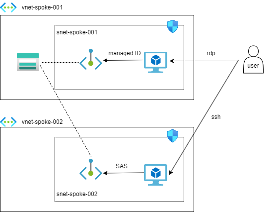

# ストレージアカウントへの接続

## 概要



- VM001からはマネージドIDによるBLOBへの接続、VM002からはSASによるBLOBへの接続を検証する
- ストレージアカウントのパブリックアクセスは無効化し、PEで接続する
- VNET間はピアリングを貼らず、PEでの連携を想定して検証する

## 手順

1. 上記リソースを作成する
2. VM001のマネージドIDを有効化とIAM設定
   1. `VM001を選択 > セキュリティ > ID > システム割り当て済み > オン`
   2. `ストレージアカウントを選択 > IAM > ロールの割り当て > ストレージBLOBデータ共同作成者`
3. VM001で疎通試験

### Windows Server 疎通試験

- コマンドプロンプトを起動

```sh
# CURL を使用して、ローカルのマネージド ID エンドポイントに対して Azure Storage のアクセス トークンを取得するよう要求
# 表示されたbearerを次のコマンドに入力
curl "http://169.254.169.254/metadata/identity/oauth2/token?api-version=2018-02-01&resource=https%3A%2F%2Fstorage.azure.com%2F" -H Metadata:true

# コンテナリストを表示
curl "https://<STORAGE ACCOUNT>.blob.core.windows.net/?comp=list" -H "x-ms-version: 2017-11-09" -H "Authorization: Bearer <ACCESS TOKEN>"

# BLOBの中身を表示
curl "https://<STORAGE ACCOUNT>.blob.core.windows.net/<CONTAINER NAME>/<FILE NAME>" -H "x-ms-version: 2017-11-09" -H "Authorization: Bearer <ACCESS TOKEN>"
```

- ローカルのマネージドIDエンドポイントにアクセスできる条件を検証するため、NSGでアウトバウンドをVNET以外拒否したが、問題なくアクセストークンが取得できた
	- 珠にあるNSGやUDRの設定などが効かない通信先と思われる
	- プライベートDNSゾーンの通信先などもそんな感じだった気がする（気がするだけでソースなし）
- エラー発生ポイント
	- Windows特有でダブルクォーテーションでなかった場合などに構文エラー
	- ロールの割り当てでストレージ共同作成者にした場合、BLOBのデータにアクセスできる包括的な権限でないためエラー
