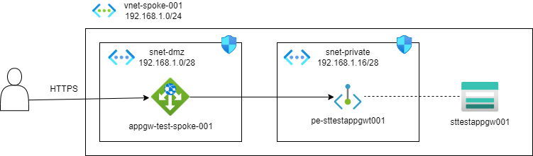

# 概要

- Azure StorageのPEのフロントにAPPGWを置けるという話を聞いたので検証
- ストレージはPublic禁止、APPGW以外からのプライベート接続も受け付けないようにしたい

# 概要図

# 手順

## リソース構築

- Azure Portal上で構築
	- RGを作成
	- vnet-spoke-001を作成
		- snet-dmz, nsg-dmzも同時に作成
	- snet-privateを作成
		- プライベートサブネットを有効化（プレビュー）
		- ネットワークポリシーでプライベートエンドポイントを選択
	- ストレージアカウント（stneko20240612）を作成
		- パブリックアクセスを禁止
		- pe-stneko20240612を同時に作成
			- サブリソースはblob、snet-privateに配置、プライベートDNS統合する
		- その他はデフォルトのためSFTP等は有効化しない
	- snet-dmzの変更
		- インバウンドで自IPからの80, 443アクセスを開通
		- インバウンドでAnyから65200-65535を開通
	- アプリケーションゲートウェイの作成
		- Standard V2、自動スケールoff、インスタンス数1、ゾーン1のみ
		- パブリックIPを追加
		- バックエンドプールでPEのIPを入力
		- バックエンド設定はHTTP
